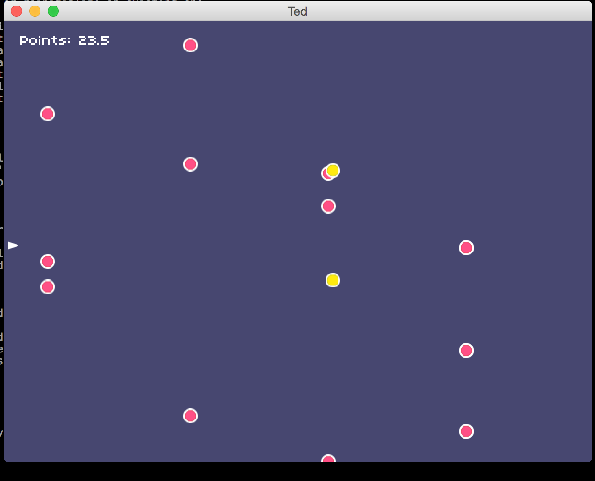

# Ted

This is the game I created during ld32. This is my second Haxe project so the code isn't so good. But the game works!

Tested with Haxe 3.1.3

# Install

```
  haxelib install haxepunk
  haxelib install lime
  haxelib run lime setup
```

# Running

```
  lime test cpp
```


